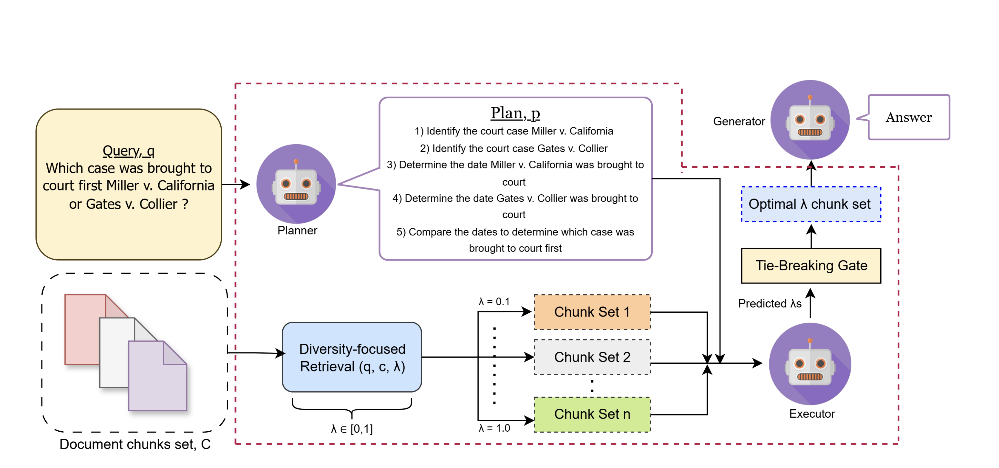
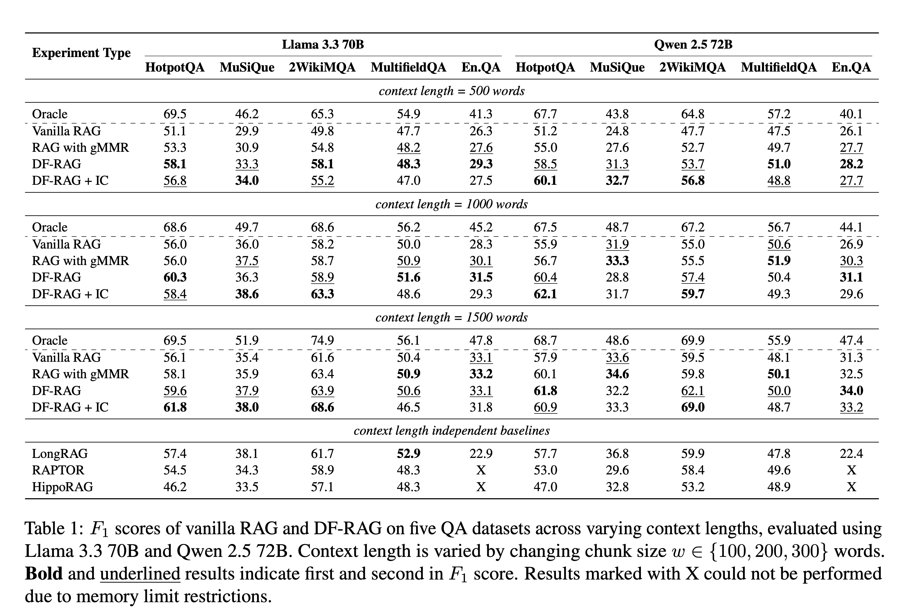

# DF-RAG: Query-Aware Diversity for Retrieval-Augmented Generation

This repository contains the code for **DF-RAG**, a training-free Retrieval-Augmented Generation method that balances query relevance and chunk diversity at inference time using geometric MMR (gMMR) and LLM based Planner and Evaluator.





## What This Repo Contains

This repo currently has a single runnable file:

- `run_dfrag.py` — end-to-end script for chunking documents, retrieving Top-K and diverse chunks, selecting best λ via Evaluator, generating answers, computing ROUGE-L, F1, and EM, and saving results to CSV.

This code xepects a LongBench-style JSONL files where each line is presented in the format: 
```bash
{
  "input": "question text",
  "context": "long document text",
  "answers": ["ground truth answer"]
}
```
## Running DF-RAG

1) Install the requirements.txt file

```bash
pip install -r requirements.txt
```

2) Run **DF-RAG** code. Example script:
```bash
python run_dfrag.py \
  --dataset 2wikimqa \
  --top_k 5 \
  --max_samples 200 \
  --chunk_size 100 \
  --overlap 0
  ```

## Results of DF-RAG


## Citation
If you use this code, please cite:
```bash
@inproceedings{dfrag2026,
  title     = {DF-RAG: Query-Aware Diversity for Retrieval-Augmented Generation},
  author    = {Saadat Hasan Khan, Spencer Hong, Jingyu Wu, Kevin Lybarger, Youbing Yin, Erin Babinsky, Daben Liu},
  booktitle = {Findings of EACL},
  year      = {2026}
}
```
